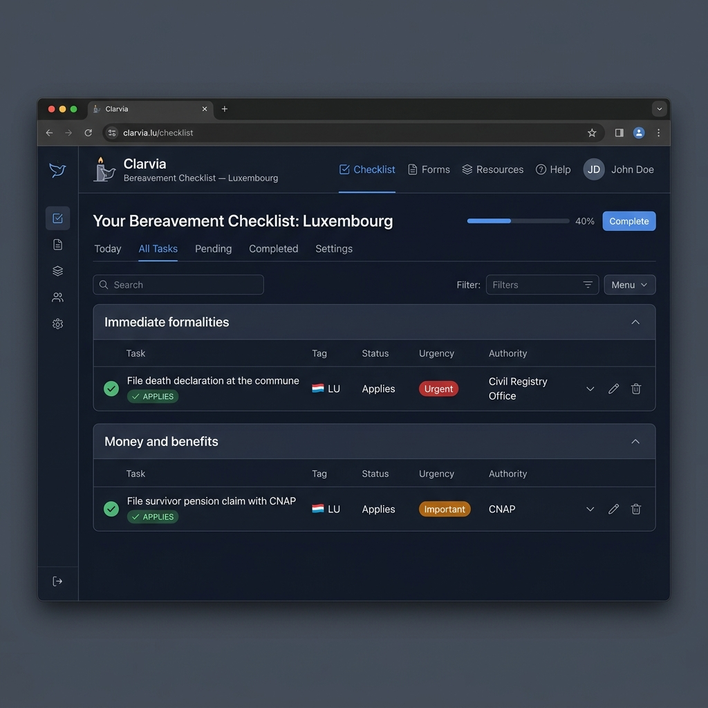

# workflow-web

[](LICENSE)

> **Status:** License: Apache-2.0 · Part of the [Clarvia](https://clarvia.org) project ([OpenSSF Best Practices: passing](https://www.bestpractices.dev/projects/13112))

This is the website that families actually see at [clarvia.org](https://clarvia.org). It turns the structured data from [clarvia-graph](https://github.com/clarvia-org/clarvia-graph) into simple, multilingual checklists that help people navigate bereavement paperwork.

[](https://clarvia.org/en/checklist)

<details>
<summary>📸 Alpha checklist preview</summary>

<br>



> This site renders checklist data generated by [clarvia-graph](https://github.com/clarvia-org/clarvia-graph). See the [example export](https://github.com/clarvia-org/clarvia-graph/blob/main/exports/example-bereavement-lu.json) for the JSON shape.

</details>

---

**A thin web layer for Clarvia's open bereavement workflow infrastructure.** This repository renders workflow data as a free, multilingual public service. It is designed as a reference consumer — the data layer is the primary artifact.

🌐 [clarvia.org](https://clarvia.org) · 🆕 [Good first issues](https://github.com/clarvia-org/workflow-web/issues?q=is%3Aissue+is%3Aopen+label%3A%22good+first+issue%22) · 🤝 [How to contribute](https://github.com/clarvia-org/.github/blob/main/CONTRIBUTING.md)

---

## Get involved

We tag approachable tasks — accessibility fixes, small UI improvements, documentation — as **good first issues**. Most can be completed in under an hour.

👉 **[Browse good first issues](https://github.com/clarvia-org/workflow-web/issues?q=is%3Aissue+is%3Aopen+label%3A%22good+first+issue%22)** to find something that fits your skills.

---

Static web layer for publishing Clarvia workflows, checklists, and generated API views.

The web layer should remain thin.

Workflow facts, source metadata, deadlines, conditions, and review status come from [`clarvia-graph`](https://github.com/clarvia-org/clarvia-graph) exports, not duplicated manually in this repository.

---

## Project scope

Clarvia provides administrative guidance based on official sources.

It does not provide individualized legal advice.

The website exists to make workflow data understandable, accessible, and trustworthy for public use.

The first public service is being built and validated for Luxembourg. The website should present that first service clearly while keeping the architecture ready for multilingual, cross-border, and future European workflow outputs.

---

## Responsibilities of this repository

This repository is responsible for:

- rendering public checklist pages,
- displaying source citations,
- displaying last-verified dates,
- presenting workflow status clearly,
- supporting accessibility,
- generating lightweight public API views where appropriate,
- presenting future heritage-folder pages clearly and safely,
- and making correction paths visible.

---

## Not in scope

This repository should not contain:

- manually duplicated workflow facts,
- personal bereavement case intake,
- user accounts,
- case-management features,
- personalized legal advice,
- unpublished reviewer notes,
- grant documents,
- partner correspondence,
- or operationally sensitive material,
- storing heritage-folder personal content.

---

## Data source

Published workflow content is generated from structured data in [`clarvia-graph`](https://github.com/clarvia-org/clarvia-graph), which produces static JSON web bundles that this repository consumes at build time.

If a web page needs administrative content, first check whether that content belongs in the data layer.

---

## Current status

This repository powers the live website at [clarvia.org](https://clarvia.org).

Current pages:

- Trilingual landing page (English, French, German),
- Language-aware root redirect,
- Dynamic sitemap with hreflang alternates,
- Turnstile-protected feedback, subscribe, and contact forms.

---

## Development model

This repository is the public web layer for Clarvia. It turns structured workflow data into simple, multilingual checklist experiences that families can actually use.

We are developing the web layer in rapid proof-of-concept, alpha, and beta phases using internal resources. This allows us to test the user journey, accessibility, language handling, source display, correction paths, and public feedback loops before formal funding timelines are complete.

This early work is not a replacement for funded development. It is a way to make progress visible, reduce delivery risk, and learn from real implementation.

Future funded phases will focus on improving the public service to a higher standard: accessibility, usability testing, localization, content review, production hardening, security, documentation, performance, and long-term maintainability.

The goal is to test limited, clearly marked public-facing versions where appropriate while identifying what must be validated, improved, and hardened before full public release.

---

## Planned improvements

> **Planned:** evaluate [`next-intl`](https://github.com/amannn/next-intl) for i18n when expanding beyond three languages. The current inline `l()` helper works for EN/FR/DE but does not scale to additional languages without touching every call site.

---

## Development

Install dependencies:

```bash
npm install
```

Run locally:

```bash
npm run dev
```

Lint:

```bash
npm run lint
```

Build:

```bash
npm run build
```

## Contributing

Contributions are welcome for:

- frontend implementation,
- accessibility,
- documentation,
- static generation,
- visual clarity,
- performance,
- validation integration,
- and generated API views.

Do not submit sensitive personal information.

See [CONTRIBUTING.md](https://github.com/clarvia-org/.github/blob/main/CONTRIBUTING.md) for details.

## License

Unless otherwise specified, code and tooling in this repository are licensed under [Apache License 2.0](LICENSE).

Content generated from workflow data may be licensed separately under Creative Commons Attribution 4.0 International.

## Related repositories

| Repository | Role |
|---|---|
| [clarvia-graph](https://github.com/clarvia-org/clarvia-graph) | Canonical data engine — schemas, graph data, validation, sources, exports |
| [.github](https://github.com/clarvia-org/.github) | Organization-wide community health files |
| [lex](https://github.com/clarvia-org/lex) | Open legal-data infrastructure — normalized national legislation for AI agents |
