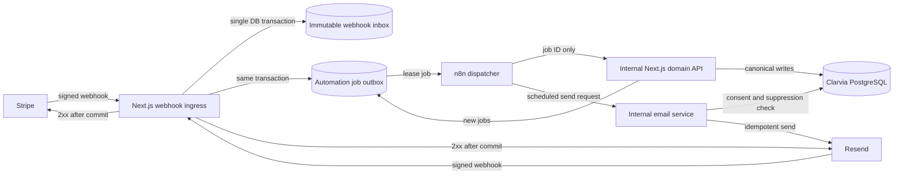
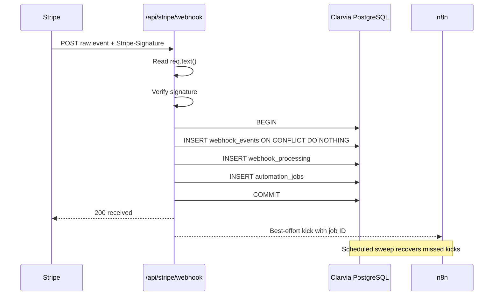
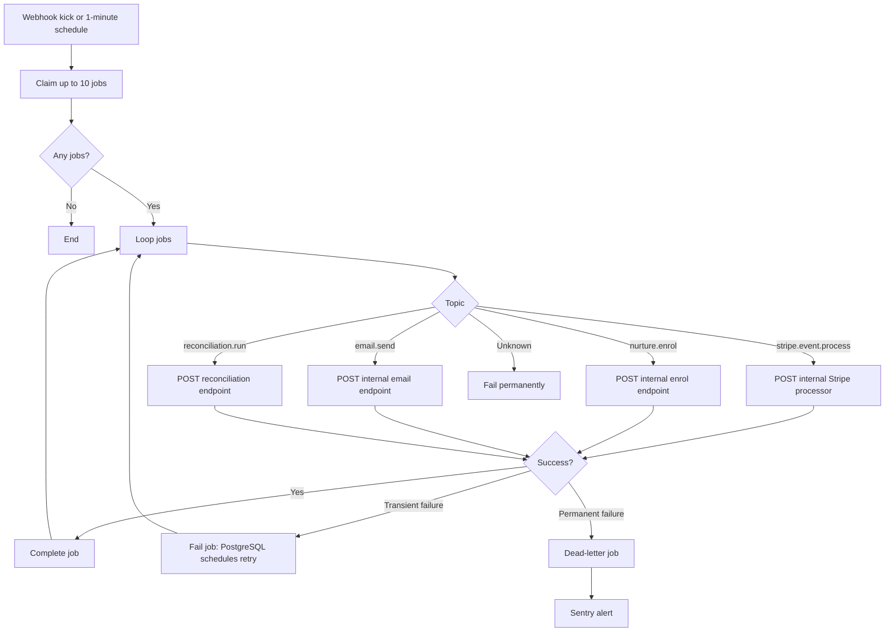
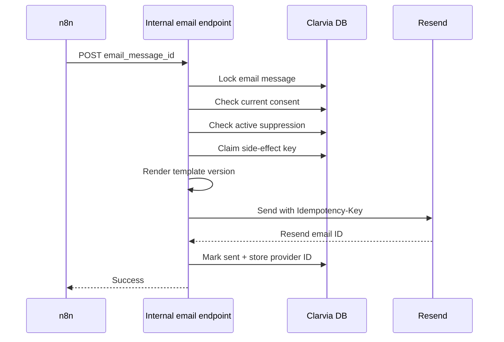

# Clarvia Donation Engine

## Execution Blueprint — PostgreSQL, Stripe, n8n, Resend and Google Ad Grants

**Status:** Implementation blueprint
**Target:** Wave 1 production deployment in 4–6 weeks
**Operating model:** Solo operator, AI-agent-assisted, public monorepo
**Primary outcome:** A durable and continuously operable donation engine capable of supporting an average of one voluntary donation per day over five years

---

# 1. Executive decisions

## 1.1 Recommended architecture

Use a **durable inbox/outbox architecture**:



The important boundary is:

> **n8n schedules and orchestrates work; TypeScript domain services and PostgreSQL enforce business rules, transactions and idempotency.**

Do not implement donation accounting as large n8n Switch/SQL workflows. Deterministic logic such as “does this invoice create a donation?” belongs in tested TypeScript functions under `src/lib/donation-engine/`.

## 1.2 Five non-negotiable rules

1. A valid Stripe or Resend event is acknowledged only after its raw event and processing job commit to PostgreSQL.
2. Webhook delivery identity, domain-object identity and external side-effect identity are separate idempotency layers.
3. n8n receives job identifiers, not donor payloads.
4. Every email send re-checks current consent and suppression immediately before calling Resend.
5. Production n8n is a deployment target, never the sole source of workflow logic.

## 1.3 Immediate risks in the current implementation

The existing Stripe handler reads the complete JSON donation file, appends an item, and rewrites the file. Concurrent deliveries can overwrite each other. More importantly, persistence errors are caught and logged while the route still returns success, allowing Stripe to consider an unrecorded donation successfully delivered.

The current code also records:

* the first monthly payment from `checkout.session.completed`;
* subsequent payments from `invoice.payment_succeeded`;
* only invoices with `billing_reason === "subscription_cycle"`.

That creates two accounting paths for one subscription and makes first-payment reconciliation more difficult.

The replacement design records **all subscription payments, including the first one, from one configured invoice event**. Checkout events link the customer, subscription, attribution and consent but do not create a subscription donation.

---

# 2. Repository target structure

```text
workflow-web/
├── src/
│   ├── app/
│   │   ├── api/
│   │   │   ├── stripe/webhook/route.ts
│   │   │   ├── resend/webhook/route.ts
│   │   │   ├── unsubscribe/route.ts
│   │   │   └── internal/automation/
│   │   │       ├── stripe/process/route.ts
│   │   │       ├── nurture/enrol/route.ts
│   │   │       ├── email/send/route.ts
│   │   │       └── reconciliation/run/route.ts
│   │   └── [lang]/support/
│   │       ├── page.tsx
│   │       ├── SupportPage.tsx
│   │       └── ads/
│   │           ├── keep-free/page.tsx
│   │           └── family-guidance/page.tsx
│   ├── features/donations/
│   │   ├── DonationForm.tsx
│   │   ├── DonationAmountSelector.tsx
│   │   ├── MarketingConsent.tsx
│   │   ├── TrustStrip.tsx
│   │   ├── DonationSuccessTracker.tsx
│   │   └── landing-page-config.ts
│   └── lib/donation-engine/
│       ├── db.ts
│       ├── webhook-inbox.ts
│       ├── job-queue.ts
│       ├── idempotency.ts
│       ├── stripe-handlers/
│       ├── resend-handlers/
│       ├── email-service.ts
│       ├── internal-auth.ts
│       └── sentry-scrubber.ts
├── automation/
│   ├── workflows/
│   │   ├── clarvia.ops.error-handler.v1.json
│   │   ├── clarvia.jobs.dispatch.v1.json
│   │   ├── clarvia.nurture.enrol.v1.json
│   │   ├── clarvia.nurture.send-due.v1.json
│   │   ├── clarvia.stripe.reconcile-daily.v1.json
│   │   └── manifest.json
│   ├── templates/
│   │   ├── components/
│   │   └── nurture/v1/
│   │       ├── mission-deep-dive/
│   │       │   ├── en.tsx
│   │       │   ├── fr.tsx
│   │       │   └── de.tsx
│   │       ├── impact-update/
│   │       └── recurring-ask/
│   ├── migrations/
│   │   ├── 0001_extensions_and_helpers.sql
│   │   ├── 0002_webhook_inbox_and_jobs.sql
│   │   ├── 0003_contacts_and_donations.sql
│   │   ├── 0004_consent_and_email.sql
│   │   ├── 0005_reconciliation.sql
│   │   └── 0006_roles_and_permissions.sql
│   ├── contracts/
│   │   ├── automation-job.schema.json
│   │   ├── stripe-process.schema.json
│   │   └── email-send.schema.json
│   ├── fixtures/
│   │   ├── stripe/
│   │   └── resend/
│   └── scripts/
│       ├── migrate.ts
│       ├── import-legacy-donations.ts
│       ├── export-n8n.sh
│       ├── validate-workflows.ts
│       ├── backup-postgres.sh
│       └── restore-test.sh
└── ...
```

The existing application currently has very few runtime dependencies beyond Next, React and Stripe. PostgreSQL support, schema validation and Sentry therefore need to be introduced deliberately rather than hidden inside workflow nodes.

Recommended additions:

```json
{
  "dependencies": {
    "@sentry/nextjs": "<pinned>",
    "@react-email/components": "<pinned>",
    "pg": "<pinned>",
    "resend": "<pinned>",
    "zod": "<pinned>"
  }
}
```

Pin exact versions in the lockfile. Do not use `latest` Docker tags or unbounded application dependencies in production.

---

# 3. PostgreSQL topology and access model

## 3.1 One PostgreSQL server, two databases

```text
PostgreSQL server
├── clarvia
│   ├── owner: clarvia_owner, NOLOGIN
│   ├── migrations: clarvia_migrator
│   ├── website: clarvia_app
│   └── automation: clarvia_automation
└── n8n
    └── owner/runtime: n8n_app
```

Requirements:

* PostgreSQL must not expose port 5432 publicly.
* Website and n8n connect over the Coolify private Docker network.
* `clarvia_app` must not access the `n8n` database.
* `n8n_app` must not access the `clarvia` database.
* `clarvia_automation` receives only the minimum Clarvia permissions needed to lease jobs and call approved stored functions.
* Credentials remain in Coolify and n8n credential storage, never in workflow JSON.

## 3.2 Bootstrap

Use secret values supplied through `psql` variables:

```sql
CREATE ROLE clarvia_owner NOLOGIN;

CREATE ROLE clarvia_migrator
  LOGIN
  PASSWORD :'clarvia_migrator_password';

CREATE ROLE clarvia_app
  LOGIN
  PASSWORD :'clarvia_app_password';

CREATE ROLE clarvia_automation
  LOGIN
  PASSWORD :'clarvia_automation_password';

CREATE ROLE n8n_app
  LOGIN
  PASSWORD :'n8n_password';

CREATE DATABASE clarvia OWNER clarvia_owner;
CREATE DATABASE n8n OWNER n8n_app;
```

After creation, change the owner of migration-created objects to `clarvia_owner`.

---

# 4. Exact schema and migrations

The following schema is intentionally modest. It provides canonical donor, payment, consent and automation records without becoming an early CiviCRM replacement.

## 4.1 `0001_extensions_and_helpers.sql`

```sql
BEGIN;

CREATE EXTENSION IF NOT EXISTS pgcrypto;
CREATE EXTENSION IF NOT EXISTS citext;

CREATE SCHEMA IF NOT EXISTS clarvia;

CREATE TABLE IF NOT EXISTS clarvia.schema_migrations (
  version       text PRIMARY KEY,
  checksum      text NOT NULL,
  applied_at    timestamptz NOT NULL DEFAULT now()
);

CREATE OR REPLACE FUNCTION clarvia.touch_updated_at()
RETURNS trigger
LANGUAGE plpgsql
AS $$
BEGIN
  NEW.updated_at := now();
  RETURN NEW;
END;
$$;

COMMIT;
```

The migration runner should:

1. obtain a PostgreSQL advisory lock;
2. calculate SHA-256 for every SQL file;
3. reject a changed checksum for an already-applied migration;
4. execute each new file in its own transaction;
5. insert its version and checksum into `schema_migrations`.

## 4.2 `0002_webhook_inbox_and_jobs.sql`

```sql
BEGIN;

CREATE TABLE clarvia.webhook_events (
  id                  uuid PRIMARY KEY DEFAULT gen_random_uuid(),
  provider            text NOT NULL
                        CHECK (provider IN ('stripe', 'resend')),
  external_event_id   text NOT NULL,
  event_type          text NOT NULL,
  api_version         text,
  livemode            boolean,
  occurred_at         timestamptz,
  received_at         timestamptz NOT NULL DEFAULT now(),
  retention_until     timestamptz NOT NULL
                        DEFAULT (now() + interval '400 days'),
  signature_metadata  jsonb NOT NULL DEFAULT '{}'::jsonb,
  payload             jsonb NOT NULL,
  payload_sha256      text NOT NULL,
  UNIQUE (provider, external_event_id)
);

CREATE INDEX webhook_events_provider_type_received_idx
  ON clarvia.webhook_events (provider, event_type, received_at DESC);

CREATE INDEX webhook_events_retention_idx
  ON clarvia.webhook_events (retention_until);

CREATE TABLE clarvia.webhook_processing (
  webhook_event_id    uuid PRIMARY KEY
                        REFERENCES clarvia.webhook_events(id)
                        ON DELETE CASCADE,
  state               text NOT NULL DEFAULT 'pending'
                        CHECK (
                          state IN (
                            'pending',
                            'leased',
                            'retry',
                            'processed',
                            'ignored',
                            'dead'
                          )
                        ),
  attempt_count       integer NOT NULL DEFAULT 0,
  available_at        timestamptz NOT NULL DEFAULT now(),
  locked_by           text,
  locked_at           timestamptz,
  lease_expires_at    timestamptz,
  processed_at        timestamptz,
  dead_lettered_at    timestamptz,
  last_error_code     text,
  last_error_message  text,
  updated_at          timestamptz NOT NULL DEFAULT now()
);

CREATE INDEX webhook_processing_ready_idx
  ON clarvia.webhook_processing (available_at, webhook_event_id)
  WHERE state IN ('pending', 'retry');

CREATE TABLE clarvia.automation_jobs (
  id                       uuid PRIMARY KEY DEFAULT gen_random_uuid(),
  topic                    text NOT NULL,
  dedupe_key               text NOT NULL UNIQUE,
  source_webhook_event_id  uuid
                             REFERENCES clarvia.webhook_events(id),
  payload                  jsonb NOT NULL DEFAULT '{}'::jsonb,
  state                    text NOT NULL DEFAULT 'pending'
                             CHECK (
                               state IN (
                                 'pending',
                                 'leased',
                                 'retry',
                                 'completed',
                                 'cancelled',
                                 'dead'
                               )
                             ),
  attempt_count            integer NOT NULL DEFAULT 0,
  max_attempts             integer NOT NULL DEFAULT 8
                             CHECK (max_attempts BETWEEN 1 AND 20),
  available_at             timestamptz NOT NULL DEFAULT now(),
  locked_by                text,
  locked_at                timestamptz,
  lease_expires_at         timestamptz,
  completed_at             timestamptz,
  dead_lettered_at         timestamptz,
  last_error_code          text,
  last_error_message       text,
  created_at               timestamptz NOT NULL DEFAULT now(),
  updated_at               timestamptz NOT NULL DEFAULT now()
);

CREATE INDEX automation_jobs_ready_idx
  ON clarvia.automation_jobs (available_at, created_at)
  WHERE state IN ('pending', 'retry');

CREATE INDEX automation_jobs_source_event_idx
  ON clarvia.automation_jobs (source_webhook_event_id);

CREATE TRIGGER automation_jobs_touch_updated_at
BEFORE UPDATE ON clarvia.automation_jobs
FOR EACH ROW EXECUTE FUNCTION clarvia.touch_updated_at();

CREATE TABLE clarvia.side_effects (
  idempotency_key          text PRIMARY KEY,
  action_type              text NOT NULL,
  aggregate_type           text,
  aggregate_id             uuid,
  source_webhook_event_id  uuid
                             REFERENCES clarvia.webhook_events(id),
  request_sha256           text,
  state                    text NOT NULL DEFAULT 'started'
                             CHECK (
                               state IN (
                                 'started',
                                 'succeeded',
                                 'retryable_failure',
                                 'permanent_failure'
                               )
                             ),
  attempt_count            integer NOT NULL DEFAULT 1,
  provider_reference       text,
  response_summary         jsonb NOT NULL DEFAULT '{}'::jsonb,
  last_error_code          text,
  last_error_message       text,
  started_at               timestamptz NOT NULL DEFAULT now(),
  completed_at             timestamptz,
  updated_at               timestamptz NOT NULL DEFAULT now()
);

CREATE INDEX side_effects_source_event_idx
  ON clarvia.side_effects (source_webhook_event_id);

CREATE TRIGGER side_effects_touch_updated_at
BEFORE UPDATE ON clarvia.side_effects
FOR EACH ROW EXECUTE FUNCTION clarvia.touch_updated_at();

CREATE OR REPLACE FUNCTION clarvia.claim_automation_jobs(
  p_worker text,
  p_limit integer DEFAULT 10,
  p_lease interval DEFAULT interval '5 minutes'
)
RETURNS SETOF clarvia.automation_jobs
LANGUAGE sql
AS $$
  WITH candidates AS (
    SELECT id
    FROM clarvia.automation_jobs
    WHERE state IN ('pending', 'retry')
      AND available_at <= now()
      AND (
        lease_expires_at IS NULL
        OR lease_expires_at <= now()
      )
    ORDER BY available_at, created_at
    FOR UPDATE SKIP LOCKED
    LIMIT p_limit
  )
  UPDATE clarvia.automation_jobs AS j
  SET state = 'leased',
      attempt_count = j.attempt_count + 1,
      locked_by = p_worker,
      locked_at = now(),
      lease_expires_at = now() + p_lease,
      updated_at = now()
  FROM candidates
  WHERE j.id = candidates.id
  RETURNING j.*;
$$;

CREATE OR REPLACE FUNCTION clarvia.complete_automation_job(
  p_job_id uuid,
  p_worker text
)
RETURNS void
LANGUAGE plpgsql
AS $$
BEGIN
  UPDATE clarvia.automation_jobs
  SET state = 'completed',
      completed_at = now(),
      locked_by = NULL,
      locked_at = NULL,
      lease_expires_at = NULL,
      last_error_code = NULL,
      last_error_message = NULL,
      updated_at = now()
  WHERE id = p_job_id
    AND state = 'leased'
    AND locked_by = p_worker;

  IF NOT FOUND THEN
    RAISE EXCEPTION 'Job % is not leased by worker %', p_job_id, p_worker;
  END IF;
END;
$$;

CREATE OR REPLACE FUNCTION clarvia.fail_automation_job(
  p_job_id uuid,
  p_worker text,
  p_error_code text,
  p_error_message text
)
RETURNS text
LANGUAGE plpgsql
AS $$
DECLARE
  v_attempt integer;
  v_max integer;
  v_next_state text;
  v_delay interval;
BEGIN
  SELECT attempt_count, max_attempts
  INTO v_attempt, v_max
  FROM clarvia.automation_jobs
  WHERE id = p_job_id
    AND state = 'leased'
    AND locked_by = p_worker
  FOR UPDATE;

  IF NOT FOUND THEN
    RAISE EXCEPTION 'Job % is not leased by worker %', p_job_id, p_worker;
  END IF;

  IF v_attempt >= v_max THEN
    v_next_state := 'dead';
    v_delay := interval '0 seconds';
  ELSE
    v_next_state := 'retry';
    v_delay := CASE
      WHEN v_attempt = 1 THEN interval '1 minute'
      WHEN v_attempt = 2 THEN interval '5 minutes'
      WHEN v_attempt = 3 THEN interval '30 minutes'
      WHEN v_attempt = 4 THEN interval '2 hours'
      ELSE interval '12 hours'
    END;
  END IF;

  UPDATE clarvia.automation_jobs
  SET state = v_next_state,
      available_at = now() + v_delay,
      dead_lettered_at = CASE
        WHEN v_next_state = 'dead' THEN now()
        ELSE dead_lettered_at
      END,
      locked_by = NULL,
      locked_at = NULL,
      lease_expires_at = NULL,
      last_error_code = left(p_error_code, 120),
      last_error_message = left(p_error_message, 2000),
      updated_at = now()
  WHERE id = p_job_id;

  RETURN v_next_state;
END;
$$;

-- Raw webhook rows cannot be changed in place. A privileged retention
-- process may delete an expired row only after setting:
-- SET LOCAL clarvia.retention_delete = 'on';

CREATE OR REPLACE FUNCTION clarvia.guard_webhook_event_mutation()
RETURNS trigger
LANGUAGE plpgsql
AS $$
BEGIN
  IF TG_OP = 'UPDATE' THEN
    RAISE EXCEPTION 'webhook_events rows are immutable';
  END IF;

  IF TG_OP = 'DELETE' THEN
    IF current_setting('clarvia.retention_delete', true) = 'on'
       AND OLD.retention_until <= now() THEN
      RETURN OLD;
    END IF;

    RAISE EXCEPTION 'webhook_events may only be deleted by the retention process';
  END IF;

  RETURN NULL;
END;
$$;

CREATE TRIGGER webhook_events_immutable
BEFORE UPDATE OR DELETE ON clarvia.webhook_events
FOR EACH ROW EXECUTE FUNCTION clarvia.guard_webhook_event_mutation();

COMMIT;
```

“Immutable” here means no in-place changes while a record is retained. It should not mean indefinite retention of raw PII. The retention policy may delete complete expired rows through a privileged process.

## 4.3 `0003_contacts_and_donations.sql`

```sql
BEGIN;

CREATE TABLE clarvia.contacts (
  id                  uuid PRIMARY KEY DEFAULT gen_random_uuid(),
  email               citext,
  display_name        text,
  preferred_locale    text NOT NULL DEFAULT 'en'
                        CHECK (preferred_locale IN ('en', 'fr', 'de', 'lu')),
  country_code        char(2),
  state               text NOT NULL DEFAULT 'active'
                        CHECK (state IN ('active', 'erased')),
  first_donation_at   timestamptz,
  last_donation_at    timestamptz,
  erased_at           timestamptz,
  created_at          timestamptz NOT NULL DEFAULT now(),
  updated_at          timestamptz NOT NULL DEFAULT now(),
  CHECK (
    (state = 'active' AND erased_at IS NULL)
    OR
    (state = 'erased' AND erased_at IS NOT NULL)
  )
);

CREATE UNIQUE INDEX contacts_active_email_uidx
  ON clarvia.contacts (email)
  WHERE email IS NOT NULL AND state = 'active';

CREATE INDEX contacts_last_donation_idx
  ON clarvia.contacts (last_donation_at DESC);

CREATE TRIGGER contacts_touch_updated_at
BEFORE UPDATE ON clarvia.contacts
FOR EACH ROW EXECUTE FUNCTION clarvia.touch_updated_at();

CREATE TABLE clarvia.stripe_customers (
  id                  uuid PRIMARY KEY DEFAULT gen_random_uuid(),
  contact_id          uuid NOT NULL
                        REFERENCES clarvia.contacts(id),
  stripe_customer_id  text NOT NULL UNIQUE,
  livemode            boolean NOT NULL,
  email_snapshot      citext,
  created_at          timestamptz NOT NULL DEFAULT now(),
  updated_at          timestamptz NOT NULL DEFAULT now()
);

CREATE INDEX stripe_customers_contact_idx
  ON clarvia.stripe_customers (contact_id);

CREATE TRIGGER stripe_customers_touch_updated_at
BEFORE UPDATE ON clarvia.stripe_customers
FOR EACH ROW EXECUTE FUNCTION clarvia.touch_updated_at();

CREATE TABLE clarvia.stripe_checkout_sessions (
  id                       uuid PRIMARY KEY DEFAULT gen_random_uuid(),
  stripe_session_id        text NOT NULL UNIQUE,
  contact_id               uuid
                             REFERENCES clarvia.contacts(id),
  stripe_customer_id       text,
  stripe_payment_intent_id text,
  stripe_subscription_id   text,
  mode                     text NOT NULL
                             CHECK (mode IN ('payment', 'subscription', 'setup')),
  donation_type            text
                             CHECK (donation_type IN ('onetime', 'monthly')),
  payment_status           text,
  session_status           text,
  amount_total_minor       bigint,
  currency                 char(3),
  marketing_opt_in         boolean NOT NULL DEFAULT false,
  consent_text_version     text,
  locale                   text
                             CHECK (locale IS NULL OR locale IN ('en', 'fr', 'de', 'lu')),
  landing_variant          text,
  attribution              jsonb NOT NULL DEFAULT '{}'::jsonb,
  source_webhook_event_id  uuid
                             REFERENCES clarvia.webhook_events(id),
  completed_at             timestamptz,
  created_at               timestamptz NOT NULL DEFAULT now(),
  updated_at               timestamptz NOT NULL DEFAULT now(),
  CHECK (
    currency IS NULL
    OR currency = upper(currency)
  )
);

CREATE INDEX stripe_checkout_sessions_subscription_idx
  ON clarvia.stripe_checkout_sessions (stripe_subscription_id)
  WHERE stripe_subscription_id IS NOT NULL;

CREATE INDEX stripe_checkout_sessions_payment_intent_idx
  ON clarvia.stripe_checkout_sessions (stripe_payment_intent_id)
  WHERE stripe_payment_intent_id IS NOT NULL;

CREATE TRIGGER stripe_checkout_sessions_touch_updated_at
BEFORE UPDATE ON clarvia.stripe_checkout_sessions
FOR EACH ROW EXECUTE FUNCTION clarvia.touch_updated_at();

CREATE TABLE clarvia.recurring_commitments (
  id                       uuid PRIMARY KEY DEFAULT gen_random_uuid(),
  contact_id               uuid NOT NULL
                             REFERENCES clarvia.contacts(id),
  stripe_customer_id       text NOT NULL,
  stripe_subscription_id   text NOT NULL UNIQUE,
  status                   text NOT NULL
                             CHECK (
                               status IN (
                                 'incomplete',
                                 'incomplete_expired',
                                 'trialing',
                                 'active',
                                 'past_due',
                                 'canceled',
                                 'unpaid',
                                 'paused'
                               )
                             ),
  amount_minor             bigint
                             CHECK (amount_minor IS NULL OR amount_minor >= 0),
  currency                 char(3),
  interval_name            text,
  interval_count           integer,
  current_period_start     timestamptz,
  current_period_end       timestamptz,
  cancel_at_period_end     boolean NOT NULL DEFAULT false,
  cancel_at                timestamptz,
  canceled_at              timestamptz,
  ended_at                 timestamptz,
  metadata                 jsonb NOT NULL DEFAULT '{}'::jsonb,
  source_webhook_event_id  uuid
                             REFERENCES clarvia.webhook_events(id),
  created_at               timestamptz NOT NULL DEFAULT now(),
  updated_at               timestamptz NOT NULL DEFAULT now(),
  CHECK (
    currency IS NULL
    OR currency = upper(currency)
  )
);

CREATE INDEX recurring_commitments_contact_status_idx
  ON clarvia.recurring_commitments (contact_id, status);

CREATE TRIGGER recurring_commitments_touch_updated_at
BEFORE UPDATE ON clarvia.recurring_commitments
FOR EACH ROW EXECUTE FUNCTION clarvia.touch_updated_at();

CREATE TABLE clarvia.donations (
  id                          uuid PRIMARY KEY DEFAULT gen_random_uuid(),
  contact_id                  uuid
                                REFERENCES clarvia.contacts(id),
  recurring_commitment_id     uuid
                                REFERENCES clarvia.recurring_commitments(id),
  provider                    text NOT NULL
                                CHECK (
                                  provider IN (
                                    'stripe',
                                    'bank_transfer',
                                    'github_sponsors',
                                    'legacy'
                                  )
                                ),
  donation_kind               text NOT NULL
                                CHECK (
                                  donation_kind IN (
                                    'one_time',
                                    'recurring_payment'
                                  )
                                ),
  status                      text NOT NULL
                                CHECK (
                                  status IN (
                                    'pending',
                                    'succeeded',
                                    'partially_refunded',
                                    'refunded',
                                    'disputed',
                                    'failed',
                                    'cancelled'
                                  )
                                ),
  currency                    char(3) NOT NULL,
  amount_gross_minor          bigint NOT NULL
                                CHECK (amount_gross_minor >= 0),
  amount_refunded_minor       bigint NOT NULL DEFAULT 0
                                CHECK (amount_refunded_minor >= 0),
  processor_fee_minor         bigint,
  amount_net_minor            bigint,
  donated_at                  timestamptz NOT NULL,
  stripe_customer_id          text,
  stripe_checkout_session_id  text,
  stripe_payment_intent_id    text,
  stripe_charge_id            text,
  stripe_invoice_id           text,
  stripe_subscription_id      text,
  external_reference          text,
  source_webhook_event_id     uuid
                                REFERENCES clarvia.webhook_events(id),
  metadata                    jsonb NOT NULL DEFAULT '{}'::jsonb,
  created_at                  timestamptz NOT NULL DEFAULT now(),
  updated_at                  timestamptz NOT NULL DEFAULT now(),
  CHECK (currency = upper(currency)),
  CHECK (amount_refunded_minor <= amount_gross_minor)
);

CREATE UNIQUE INDEX donations_stripe_checkout_session_uidx
  ON clarvia.donations (stripe_checkout_session_id)
  WHERE provider = 'stripe'
    AND stripe_checkout_session_id IS NOT NULL;

CREATE UNIQUE INDEX donations_stripe_payment_intent_uidx
  ON clarvia.donations (stripe_payment_intent_id)
  WHERE provider = 'stripe'
    AND stripe_payment_intent_id IS NOT NULL;

CREATE UNIQUE INDEX donations_stripe_charge_uidx
  ON clarvia.donations (stripe_charge_id)
  WHERE provider = 'stripe'
    AND stripe_charge_id IS NOT NULL;

CREATE UNIQUE INDEX donations_stripe_invoice_uidx
  ON clarvia.donations (stripe_invoice_id)
  WHERE provider = 'stripe'
    AND stripe_invoice_id IS NOT NULL;

CREATE UNIQUE INDEX donations_external_reference_uidx
  ON clarvia.donations (provider, external_reference)
  WHERE external_reference IS NOT NULL;

CREATE INDEX donations_contact_date_idx
  ON clarvia.donations (contact_id, donated_at DESC);

CREATE INDEX donations_status_date_idx
  ON clarvia.donations (status, donated_at DESC);

CREATE INDEX donations_subscription_idx
  ON clarvia.donations (stripe_subscription_id, donated_at DESC)
  WHERE stripe_subscription_id IS NOT NULL;

CREATE TRIGGER donations_touch_updated_at
BEFORE UPDATE ON clarvia.donations
FOR EACH ROW EXECUTE FUNCTION clarvia.touch_updated_at();

CREATE TABLE clarvia.donation_attributions (
  donation_id         uuid PRIMARY KEY
                        REFERENCES clarvia.donations(id)
                        ON DELETE CASCADE,
  landing_variant     text,
  source              text,
  medium              text,
  campaign            text,
  term                text,
  content             text,
  gclid               text,
  ga_client_id        text,
  captured_at         timestamptz NOT NULL DEFAULT now(),
  raw                 jsonb NOT NULL DEFAULT '{}'::jsonb
);

CREATE TABLE clarvia.donation_events (
  id                       bigint GENERATED ALWAYS AS IDENTITY PRIMARY KEY,
  donation_id              uuid
                             REFERENCES clarvia.donations(id),
  source_webhook_event_id  uuid NOT NULL
                             REFERENCES clarvia.webhook_events(id),
  event_type               text NOT NULL,
  provider_object_type     text,
  provider_object_id       text,
  occurred_at              timestamptz NOT NULL,
  details                  jsonb NOT NULL DEFAULT '{}'::jsonb,
  created_at               timestamptz NOT NULL DEFAULT now()
);

CREATE UNIQUE INDEX donation_events_dedupe_uidx
  ON clarvia.donation_events (
    source_webhook_event_id,
    event_type,
    coalesce(provider_object_id, '')
  );

CREATE INDEX donation_events_donation_idx
  ON clarvia.donation_events (donation_id, occurred_at DESC);

COMMIT;
```

### Locale discrepancy

The brief describes three locales, but the current support and Checkout code includes Luxembourgish `lu` branches.

The database should therefore accept `lu` from the start. Until Luxembourgish nurture templates exist, resolve email locale as:

```text
en → en
fr → fr
de → de
lu → fr
unknown → en
```

Do not silently reject or rewrite existing `lu` attribution.

## 4.4 `0004_consent_and_email.sql`

```sql
BEGIN;

CREATE TABLE clarvia.consent_records (
  id                  uuid PRIMARY KEY DEFAULT gen_random_uuid(),
  contact_id          uuid NOT NULL
                        REFERENCES clarvia.contacts(id),
  purpose             text NOT NULL
                        CHECK (purpose IN ('marketing_email')),
  action              text NOT NULL
                        CHECK (action IN ('granted', 'withdrawn')),
  lawful_basis        text NOT NULL DEFAULT 'consent'
                        CHECK (lawful_basis = 'consent'),
  policy_version      text NOT NULL,
  text_version        text NOT NULL,
  locale              text NOT NULL
                        CHECK (locale IN ('en', 'fr', 'de', 'lu')),
  source              text NOT NULL
                        CHECK (
                          source IN (
                            'donation_page',
                            'subscribe_form',
                            'unsubscribe',
                            'resend_complaint',
                            'manual_admin',
                            'legacy_import'
                          )
                        ),
  source_reference    text,
  idempotency_key     text NOT NULL UNIQUE,
  evidence            jsonb NOT NULL DEFAULT '{}'::jsonb,
  occurred_at         timestamptz NOT NULL,
  recorded_at         timestamptz NOT NULL DEFAULT now()
);

CREATE INDEX consent_records_contact_purpose_idx
  ON clarvia.consent_records (
    contact_id,
    purpose,
    occurred_at DESC,
    recorded_at DESC
  );

CREATE VIEW clarvia.current_consents AS
SELECT DISTINCT ON (contact_id, purpose)
  id,
  contact_id,
  purpose,
  action,
  policy_version,
  text_version,
  locale,
  source,
  occurred_at
FROM clarvia.consent_records
ORDER BY
  contact_id,
  purpose,
  occurred_at DESC,
  recorded_at DESC,
  id DESC;

CREATE TABLE clarvia.email_suppressions (
  id                       uuid PRIMARY KEY DEFAULT gen_random_uuid(),
  email                    citext NOT NULL,
  reason                   text NOT NULL
                             CHECK (
                               reason IN (
                                 'unsubscribe',
                                 'complaint',
                                 'bounce',
                                 'provider_suppression',
                                 'manual'
                               )
                             ),
  source                   text NOT NULL
                             CHECK (
                               source IN (
                                 'clarvia',
                                 'resend',
                                 'manual'
                               )
                             ),
  source_webhook_event_id  uuid
                             REFERENCES clarvia.webhook_events(id),
  source_reference         text,
  active                   boolean NOT NULL DEFAULT true,
  created_at               timestamptz NOT NULL DEFAULT now(),
  lifted_at                timestamptz,
  notes                    text,
  CHECK (
    (active = true AND lifted_at IS NULL)
    OR
    (active = false AND lifted_at IS NOT NULL)
  )
);

CREATE UNIQUE INDEX email_suppressions_active_reason_uidx
  ON clarvia.email_suppressions (email, reason)
  WHERE active = true;

CREATE INDEX email_suppressions_active_email_idx
  ON clarvia.email_suppressions (email)
  WHERE active = true;

CREATE TABLE clarvia.nurture_enrollments (
  id                    uuid PRIMARY KEY DEFAULT gen_random_uuid(),
  contact_id            uuid NOT NULL
                          REFERENCES clarvia.contacts(id),
  origin_donation_id    uuid NOT NULL
                          REFERENCES clarvia.donations(id),
  sequence_key          text NOT NULL,
  sequence_version      integer NOT NULL,
  audience_variant      text NOT NULL
                          CHECK (
                            audience_variant IN (
                              'one_time_donor',
                              'monthly_donor'
                            )
                          ),
  state                 text NOT NULL DEFAULT 'active'
                          CHECK (
                            state IN (
                              'active',
                              'completed',
                              'cancelled',
                              'suppressed'
                            )
                          ),
  started_at            timestamptz NOT NULL DEFAULT now(),
  completed_at          timestamptz,
  cancelled_at          timestamptz,
  cancellation_reason   text,
  created_at            timestamptz NOT NULL DEFAULT now(),
  updated_at            timestamptz NOT NULL DEFAULT now(),
  -- NOTE: Lifetime uniqueness is intentional: a contact can be enrolled at most once
  -- per sequence_key, even after completion/cancellation/suppression. If future
  -- requirements allow re-enrollment, replace this with a migration (for example,
  -- a partial unique index limited to active enrollments).
  UNIQUE (contact_id, sequence_key)
);

CREATE TRIGGER nurture_enrollments_touch_updated_at
BEFORE UPDATE ON clarvia.nurture_enrollments
FOR EACH ROW EXECUTE FUNCTION clarvia.touch_updated_at();

CREATE TABLE clarvia.email_messages (
  id                    uuid PRIMARY KEY DEFAULT gen_random_uuid(),
  contact_id            uuid NOT NULL
                          REFERENCES clarvia.contacts(id),
  enrollment_id         uuid
                          REFERENCES clarvia.nurture_enrollments(id),
  donation_id           uuid
                          REFERENCES clarvia.donations(id),
  consent_record_id     uuid
                          REFERENCES clarvia.consent_records(id),
  sequence_key          text,
  sequence_step         integer,
  template_key          text NOT NULL,
  template_version      integer NOT NULL,
  locale                text NOT NULL
                          -- Resolved send locale only; map unsupported donor locale 'lu' -> 'fr' before insert/upsert.
                          CHECK (locale IN ('en', 'fr', 'de')),
  idempotency_key       text NOT NULL UNIQUE,
  status                text NOT NULL DEFAULT 'scheduled'
                          CHECK (
                            status IN (
                              'scheduled',
                              'claimed',
                              'sent',
                              'delivered',
                              'suppressed',
                              'bounced',
                              'complained',
                              'failed',
                              'cancelled'
                            )
                          ),
  scheduled_for         timestamptz NOT NULL,
  resend_email_id       text UNIQUE,
  sent_at               timestamptz,
  delivered_at          timestamptz,
  failed_at             timestamptz,
  last_error_code       text,
  last_error_message    text,
  created_at            timestamptz NOT NULL DEFAULT now(),
  updated_at            timestamptz NOT NULL DEFAULT now()
);

CREATE INDEX email_messages_due_idx
  ON clarvia.email_messages (scheduled_for, id)
  WHERE status = 'scheduled';

CREATE INDEX email_messages_contact_idx
  ON clarvia.email_messages (contact_id, created_at DESC);

CREATE TRIGGER email_messages_touch_updated_at
BEFORE UPDATE ON clarvia.email_messages
FOR EACH ROW EXECUTE FUNCTION clarvia.touch_updated_at();

CREATE TABLE clarvia.automation_state (
  key           text PRIMARY KEY,
  value         jsonb NOT NULL,
  version       bigint NOT NULL DEFAULT 1,
  updated_at    timestamptz NOT NULL DEFAULT now()
);

COMMIT;
```

## 4.5 `0005_reconciliation.sql`

```sql
BEGIN;

CREATE TABLE clarvia.reconciliation_runs (
  id                    uuid PRIMARY KEY DEFAULT gen_random_uuid(),
  provider              text NOT NULL CHECK (provider = 'stripe'),
  run_type              text NOT NULL
                          CHECK (run_type IN ('daily', 'manual', 'deep')),
  period_start          timestamptz NOT NULL,
  period_end            timestamptz NOT NULL,
  state                 text NOT NULL DEFAULT 'running'
                          CHECK (
                            state IN (
                              'running',
                              'completed',
                              'completed_with_mismatches',
                              'failed'
                            )
                          ),
  objects_checked       integer NOT NULL DEFAULT 0,
  mismatch_count        integer NOT NULL DEFAULT 0,
  started_at            timestamptz NOT NULL DEFAULT now(),
  completed_at          timestamptz,
  last_error_message    text,
  summary               jsonb NOT NULL DEFAULT '{}'::jsonb
);

CREATE INDEX reconciliation_runs_started_idx
  ON clarvia.reconciliation_runs (started_at DESC);

CREATE TABLE clarvia.reconciliation_items (
  id                     uuid PRIMARY KEY DEFAULT gen_random_uuid(),
  reconciliation_run_id  uuid NOT NULL
                           REFERENCES clarvia.reconciliation_runs(id)
                           ON DELETE CASCADE,
  object_type            text NOT NULL
                           CHECK (
                             object_type IN (
                               'checkout_session',
                               'payment_intent',
                               'invoice',
                               'subscription',
                               'refund'
                             )
                           ),
  stripe_object_id       text NOT NULL,
  finding                text NOT NULL
                           CHECK (
                             finding IN (
                               'missing_locally',
                               'amount_mismatch',
                               'currency_mismatch',
                               'status_mismatch',
                               'orphan_local_record'
                             )
                           ),
  severity               text NOT NULL
                           CHECK (severity IN ('info', 'warning', 'critical')),
  expected               jsonb NOT NULL DEFAULT '{}'::jsonb,
  actual                 jsonb NOT NULL DEFAULT '{}'::jsonb,
  repair_job_id          uuid
                           REFERENCES clarvia.automation_jobs(id),
  resolved_at            timestamptz,
  resolution_notes       text,
  created_at             timestamptz NOT NULL DEFAULT now(),
  UNIQUE (
    reconciliation_run_id,
    object_type,
    stripe_object_id,
    finding
  )
);

CREATE INDEX reconciliation_items_unresolved_idx
  ON clarvia.reconciliation_items (severity, created_at)
  WHERE resolved_at IS NULL;

COMMIT;
```

## 4.6 Permission model

`clarvia_app`:

* insert raw webhook rows and initial jobs;
* run domain transactions;
* read and update Clarvia domain tables;
* cannot mutate raw webhook rows.

`clarvia_automation`:

* select pending job metadata;
* execute `claim_automation_jobs`, `complete_automation_job` and `fail_automation_job`;
* call narrowly defined operational functions;
* cannot select raw webhook payloads, contact emails or unrestricted donor tables.

Illustrative grants:

```sql
GRANT USAGE ON SCHEMA clarvia
TO clarvia_app, clarvia_automation;

GRANT SELECT, INSERT ON clarvia.webhook_events
TO clarvia_app;

GRANT SELECT, INSERT, UPDATE ON
  clarvia.webhook_processing,
  clarvia.automation_jobs,
  clarvia.side_effects,
  clarvia.contacts,
  clarvia.stripe_customers,
  clarvia.stripe_checkout_sessions,
  clarvia.recurring_commitments,
  clarvia.donations,
  clarvia.donation_attributions,
  clarvia.donation_events,
  clarvia.consent_records,
  clarvia.email_suppressions,
  clarvia.nurture_enrollments,
  clarvia.email_messages,
  clarvia.automation_state,
  clarvia.reconciliation_runs,
  clarvia.reconciliation_items
TO clarvia_app;

GRANT SELECT ON clarvia.automation_jobs
TO clarvia_automation;

GRANT EXECUTE ON FUNCTION
  clarvia.claim_automation_jobs(text, integer, interval),
  clarvia.complete_automation_job(uuid, text),
  clarvia.fail_automation_job(uuid, text, text, text)
TO clarvia_automation;
```

---

# 5. Stripe webhook ingestion

Stripe recommends preserving the raw body for signature verification, returning a successful response quickly, and designing for duplicate delivery. Stripe retries failed webhook delivery for up to three days.

## 5.1 Ingress sequence



Correct response behavior:

| Situation                                 | HTTP response |
| ----------------------------------------- | ------------: |
| Missing signature                         |         `400` |
| Invalid signature                         |         `400` |
| Valid duplicate event already committed   |         `200` |
| Valid event committed successfully        |         `200` |
| Database unavailable or transaction fails |         `500` |
| n8n unavailable after commit              |         `200` |

n8n availability must never influence whether Stripe receives a success response.

## 5.2 Route shape

```ts
import { after, NextRequest, NextResponse } from "next/server";
import { createHash } from "node:crypto";
import { getStripe } from "@/lib/stripe";
import { db } from "@/lib/donation-engine/db";
import { kickAutomation } from "@/lib/donation-engine/job-queue";

export const runtime = "nodejs";

export async function POST(req: NextRequest) {
  const stripe = getStripe();
  const secret = process.env.STRIPE_WEBHOOK_SECRET;

  if (!stripe || !secret) {
    return NextResponse.json(
      { error: "Webhook unavailable" },
      { status: 503 }
    );
  }

  const rawBody = await req.text();
  const signature = req.headers.get("stripe-signature");

  if (!signature) {
    return NextResponse.json(
      { error: "Missing signature" },
      { status: 400 }
    );
  }

  let event;

  try {
    event = stripe.webhooks.constructEvent(
      rawBody,
      signature,
      secret
    );
  } catch {
    return NextResponse.json(
      { error: "Invalid signature" },
      { status: 400 }
    );
  }

  const payloadHash = createHash("sha256")
    .update(rawBody)
    .digest("hex");

  try {
    const result = await db.transaction(async (tx) => {
      const inserted = await tx.oneOrNone<{
        event_id: string;
      }>(
        `
        INSERT INTO clarvia.webhook_events (
          provider,
          external_event_id,
          event_type,
          api_version,
          livemode,
          occurred_at,
          signature_metadata,
          payload,
          payload_sha256
        )
        VALUES (
          'stripe',
          $1,
          $2,
          $3,
          $4,
          to_timestamp($5),
          $6::jsonb,
          $7::jsonb,
          $8
        )
        ON CONFLICT (provider, external_event_id)
        DO NOTHING
        RETURNING id AS event_id
        `,
        [
          event.id,
          event.type,
          event.api_version,
          event.livemode,
          event.created,
          JSON.stringify({
            signature_header_sha256: createHash("sha256")
              .update(signature)
              .digest("hex"),
          }),
          rawBody,
          payloadHash,
        ]
      );

      if (!inserted) {
        return { duplicate: true, jobId: null };
      }

      await tx.none(
        `
        INSERT INTO clarvia.webhook_processing (
          webhook_event_id
        )
        VALUES ($1)
        `,
        [inserted.event_id]
      );

      const job = await tx.one<{ id: string }>(
        `
        INSERT INTO clarvia.automation_jobs (
          topic,
          dedupe_key,
          source_webhook_event_id,
          payload
        )
        VALUES (
          'stripe.event.process',
          $1,
          $2,
          jsonb_build_object('webhook_event_id', $2)
        )
        RETURNING id
        `,
        [
          `stripe:${event.id}:process:v1`,
          inserted.event_id,
        ]
      );

      return { duplicate: false, jobId: job.id };
    });

    if (result.jobId) {
      after(async () => {
        await kickAutomation(result.jobId).catch(() => undefined);
      });
    }

    return NextResponse.json({
      received: true,
      duplicate: result.duplicate,
    });
  } catch (error) {
    // Capture only a scrubbed operational exception.
    return NextResponse.json(
      { error: "Durable ingestion failed" },
      { status: 500 }
    );
  }
}
```

`after()` is only a low-latency wake-up. Correctness depends on the committed job plus the n8n scheduled sweep.

## 5.3 Internal call authentication

All n8n-to-website calls use:

```text
X-Clarvia-Timestamp: 2026-07-11T12:34:56Z
X-Clarvia-Signature: hex(HMAC-SHA256(secret, timestamp + "." + rawBody))
```

The app must:

* reject timestamps older than five minutes;
* compare signatures in constant time;
* accept only the private n8n URL/network where practical;
* accept a job ID rather than donor data;
* load the actual job and source event from PostgreSQL;
* verify the job is currently leased.

---

# 6. Stripe event processing matrix

Subscribe only to events Clarvia can process. Every other received event is stored and marked `ignored`.

## 6.1 Canonical event policy

### One-time donations

Canonical creation event:

* `checkout.session.completed` when `mode=payment` and `payment_status=paid`;
* `checkout.session.async_payment_succeeded` for delayed methods.

Natural uniqueness:

* first choice: `stripe_payment_intent_id`;
* second choice: `stripe_checkout_session_id`.

### Subscription donations

Canonical creation event:

* configure exactly one of `invoice.payment_succeeded` or `invoice.paid`;
* process both `subscription_create` and `subscription_cycle`;
* create one donation per unique Stripe invoice ID.

Do not configure both invoice events as independent donation-producing paths.

### Subscription state

* `customer.subscription.created`
* `customer.subscription.updated`
* `customer.subscription.deleted`

These update the commitment; they do not create payments.

## 6.2 Event table

| Stripe event                               | Processing                                                                                                                                                                                                                                   |
| ------------------------------------------ | -------------------------------------------------------------------------------------------------------------------------------------------------------------------------------------------------------------------------------------------- |
| `checkout.session.completed`               | Retrieve expanded session. Upsert contact/customer/session. Record consent evidence and attribution. Create one-time donation only when `mode=payment` and paid. Link subscription when `mode=subscription`; do not create its payment here. |
| `checkout.session.async_payment_succeeded` | Same one-time donation upsert, keyed by PaymentIntent/session.                                                                                                                                                                               |
| `checkout.session.async_payment_failed`    | Update checkout session and append a failed donation event; no successful donation.                                                                                                                                                          |
| `invoice.payment_succeeded`                | Upsert commitment; create or update recurring donation keyed by invoice ID for both initial and renewal invoices.                                                                                                                            |
| `customer.subscription.created`            | Upsert recurring commitment.                                                                                                                                                                                                                 |
| `customer.subscription.updated`            | Update status, amount, period and cancellation fields.                                                                                                                                                                                       |
| `customer.subscription.deleted`            | Mark commitment canceled and set `ended_at`.                                                                                                                                                                                                 |
| `invoice.payment_failed`                   | Update commitment to relevant Stripe status; create audit event; optionally alert after repeated failures.                                                                                                                                   |
| `charge.refunded`                          | Resolve donation by charge or PaymentIntent. Update refunded amount and status.                                                                                                                                                              |
| `charge.dispute.created`                   | Mark donation disputed and create a critical operational alert.                                                                                                                                                                              |
| `payment_intent.payment_failed`            | Update one-time checkout status and audit failure. No donation nurture.                                                                                                                                                                      |

## 6.3 Idempotency layers

### Layer 1: delivery idempotency

```text
UNIQUE(provider, external_event_id)
```

Stops duplicate webhook deliveries.

### Layer 2: domain idempotency

Examples:

```text
UNIQUE(stripe_invoice_id)
UNIQUE(stripe_payment_intent_id)
UNIQUE(stripe_checkout_session_id)
UNIQUE(stripe_subscription_id)
```

Stops two different Stripe events from creating the same business object.

### Layer 3: side-effect idempotency

Use semantic keys:

```text
donation:{donation_id}:nurture-enrol:v1
email:{email_message_id}:resend-send:v1
reconciliation:{run_id}:{stripe_object_id}:repair:v1
```

Semantic aggregate keys are safer than only `stripe_event_id + action`, because the same donation may legitimately appear through two related events or a reconciliation repair.

Resend accepts an `Idempotency-Key`, but its provider-side idempotency window is limited. Clarvia’s `side_effects` and `email_messages` tables remain the long-term guard.

## 6.4 Domain transaction pattern

For each event:

1. Lock the `webhook_processing` record.
2. Return success if already `processed` or `ignored`.
3. Claim a side-effect key for the handler version.
4. Retrieve current Stripe objects where stale snapshots would be risky.
5. Upsert contact and provider references.
6. Upsert domain records using Stripe natural keys.
7. Append `donation_events`.
8. Add follow-on automation jobs in the same transaction.
9. Mark webhook processing complete.
10. Complete the leased automation job.

Do not mark the job complete before the domain transaction commits.

---

# 7. n8n workflow architecture

n8n provides error workflows and retry controls, but Clarvia’s durable retry state should remain in PostgreSQL rather than relying only on n8n execution history.

## 7.1 Workflow inventory

| Workflow                            | Trigger                                | Responsibility                                                                             |
| ----------------------------------- | -------------------------------------- | ------------------------------------------------------------------------------------------ |
| `clarvia.ops.error-handler.v1`      | Error Trigger                          | Scrub execution context, update failed job when known, send Sentry operational event.      |
| `clarvia.jobs.dispatch.v1`          | Internal webhook and 1-minute schedule | Lease pending jobs and dispatch each by topic.                                             |
| `clarvia.nurture.enrol.v1`          | Job topic                              | Ask internal API to create one consent-gated onboarding enrollment and scheduled messages. |
| `clarvia.nurture.send-due.v1`       | Every 10 minutes                       | Find due email message IDs and call the internal email-send endpoint.                      |
| `clarvia.stripe.reconcile-daily.v1` | Daily at 03:15 Europe/Luxembourg       | Compare Stripe objects with canonical records and queue deterministic repairs.             |
| `clarvia.ops.health-daily.v1`       | Daily                                  | Detect dead jobs, old pending jobs, failed backups and expiring reconciliation cursors.    |

Stripe and Resend event interpretation should not be implemented as editable node mazes. The dispatcher calls versioned internal application endpoints.

## 7.2 Dispatcher



Recommended node-level retry:

* connection timeout: 10 seconds;
* HTTP node retry: at most three attempts with a short delay;
* no multi-hour waits inside an execution;
* after immediate retries fail, call `fail_automation_job`;
* PostgreSQL sets the durable retry schedule.

## 7.3 Dead-letter rules

A job becomes `dead` when:

* it reaches `max_attempts`;
* its topic is unknown;
* its payload fails schema validation;
* its source record is structurally invalid;
* an external provider gives a confirmed permanent rejection.

Every dead job must contain:

* short stable error code;
* scrubbed error message;
* source event or aggregate ID;
* attempt count;
* dead-letter timestamp.

Operator replay:

```sql
UPDATE clarvia.automation_jobs
SET state = 'retry',
    available_at = now(),
    attempt_count = 0,
    dead_lettered_at = NULL,
    last_error_code = NULL,
    last_error_message = NULL
WHERE id = :'job_id'
  AND state = 'dead';
```

The replay script must require a reason and write an operator audit record. Never replay by editing n8n execution data.

## 7.4 Execution retention

Keep n8n execution data short:

* successful executions: seven days;
* failed executions: 30 days;
* no binary payload retention;
* execution pruning enabled;
* no donor email addresses in custom execution data;
* no pinned production data in workflow exports.

n8n documents execution pruning and explicit execution-data controls.

---

# 8. Resend architecture

## 8.1 Sending path

n8n must not call Resend directly with an email address and HTML.

Instead:



This prevents a stale n8n execution from sending after an unsubscribe or complaint.

## 8.2 Resend webhook ingestion

Public route:

```text
POST /api/resend/webhook
```

Processing:

1. Read raw body.
2. Verify the Svix/Resend signature.
3. Use `svix-id` as `external_event_id`.
4. Commit raw event and an automation job.
5. Return `200`.
6. Process:

   * `email.delivered`;
   * `email.bounced`;
   * `email.complained`;
   * `email.failed`;
   * `email.suppressed`.

Resend recommends raw-body signature verification and deduplication using the webhook message ID. It retries failed webhook deliveries and supports replay.

Suppression behavior:

| Event      | Action                                                                                              |
| ---------- | --------------------------------------------------------------------------------------------------- |
| Complaint  | Withdraw marketing consent and add permanent complaint suppression.                                 |
| Bounce     | Mark message bounced and add suppression. Manual review is required before lifting it.              |
| Suppressed | Add provider-suppression record.                                                                    |
| Failed     | Mark message failed; suppress only when the failure reason indicates an invalid or blocked address. |
| Delivered  | Mark message delivered.                                                                             |

## 8.3 Sending domain

Use a dedicated marketing subdomain, for example:

```text
mail.clarvia.org
```

Suggested sender:

```text
Clarvia <updates@mail.clarvia.org>
```

Suggested reply-to:

```text
contact@clarvia.org
```

Configure SPF, DKIM and DMARC before sending. Resend’s current plans include domain authentication, automatic suppression handling and signed webhooks.

---

# 9. Consent design

## 9.1 Donation-page checkbox

Place an unchecked checkbox directly below the donation selector.

### English

> Yes, email me occasional updates about Clarvia’s impact and ways to support its free bereavement resources. I can unsubscribe at any time.

### French

> Oui, je souhaite recevoir occasionnellement des nouvelles sur l’impact de Clarvia et les moyens de soutenir ses ressources gratuites consacrées aux démarches après un décès. Je peux me désabonner à tout moment.

### German

> Ja, ich möchte gelegentlich Neuigkeiten über die Wirkung von Clarvia und Möglichkeiten zur Unterstützung der kostenlosen Hilfen für Formalitäten nach einem Todesfall erhalten. Ich kann mich jederzeit abmelden.

Requirements:

* unchecked by default;
* optional and independent of the donation;
* versioned as `marketing-donation-v1`;
* passed to `/api/donate`;
* copied by the server into Stripe Checkout metadata;
* converted into a consent record only after a completed Checkout session provides the contact email;
* exact wording, version, locale, time and session ID stored as evidence.

Extend the existing request from:

```json
{
  "amount": 25,
  "type": "monthly",
  "lang": "en"
}
```

to:

```json
{
  "amount": 25,
  "type": "monthly",
  "lang": "en",
  "marketingOptIn": true,
  "consentTextVersion": "marketing-donation-v1",
  "landingVariant": "ads-keep-free-v1",
  "attribution": {
    "source": "google",
    "medium": "cpc",
    "campaign": "bereavement-support-luxembourg",
    "term": "...",
    "content": "...",
    "gclid": "..."
  }
}
```

The present endpoint sends only donation type in Stripe metadata, so attribution and consent need an explicit extension.

## 9.2 Unsubscribe design

Use a signed, expiring token containing:

```json
{
  "contact_id": "...",
  "email_message_id": "...",
  "purpose": "marketing_email"
}
```

* A normal browser `GET` shows a confirmation page.
* The actual change is made by `POST`.
* This avoids link scanners unsubscribing people merely by opening a URL.
* The POST appends a `withdrawn` consent record and an active `unsubscribe` suppression in one transaction.
* Include standards-compatible `List-Unsubscribe` and one-click headers in marketing messages.

---

# 10. Nurture sequence

Stripe continues to send immediate receipts and payment thank-you messages. Clarvia’s first nurture email should therefore not repeat “we received your donation.”

## 10.1 Timing

| Step              |             Timing | Objective                                                            |
| ----------------- | -----------------: | -------------------------------------------------------------------- |
| Mission deep-dive |  Donation + 5 days | Explain why Clarvia exists and point to the public resource.         |
| Impact update     | Donation + 18 days | Explain concretely how donations are used.                           |
| Recurring ask     | Donation + 40 days | Invite one-time donors to consider monthly support without pressure. |

For an existing monthly donor, replace email three with a “stay connected and share feedback” variant. Never ask an active monthly donor to start monthly giving.

Enrollment conditions:

```text
successful donation
AND active marketing consent
AND no active suppression
AND no previous donor_onboarding enrollment
```

Send-time conditions are checked again for every message.

## 10.2 Template structure

Each source template exports:

```ts
export const metadata = {
  key: "mission-deep-dive",
  version: 1,
  locale: "en",
  subject: "Why Clarvia exists",
  preheader: "Making difficult administrative steps easier to understand."
};
```

Common components:

* `EmailLayout`
* `ClarviaWordmark`
* `PrimaryButton`
* `LegalFooter`
* `UnsubscribeLink`
* `PlainTextRenderer`

CI renders every template to HTML and text, checks required variables and takes snapshots.

## 10.3 Finished template copy

### Email 1 — Mission deep-dive

#### English

**Subject:** Why Clarvia exists
**Preheader:** Making difficult administrative steps easier to understand.

Hello {{first_name_or_friend}},

After someone dies, families are often expected to contact institutions, complete forms and understand deadlines while they are still grieving.

The information usually exists, but it is spread across different official websites and procedures. Clarvia brings those steps together in a free, open-source checklist designed to show what needs attention first and what can wait.

Your support helps us keep that guidance accessible, multilingual and based on official sources.

You can see the checklist here:

**{{checklist_url}}**

Thank you for helping make practical information available to everyone who may need it.

Clarvia ASBL

#### French

**Objet :** Pourquoi Clarvia existe
**Pré-en-tête :** Rendre les démarches administratives difficiles plus faciles à comprendre.

Bonjour {{first_name_or_friend}},

Après un décès, les familles doivent souvent contacter des institutions, remplir des formulaires et comprendre des délais alors qu’elles traversent encore une période de deuil.

Les informations existent généralement, mais elles sont dispersées entre différents sites officiels et différentes procédures. Clarvia réunit ces étapes dans une liste gratuite et open source qui aide à comprendre ce qui doit être fait en premier et ce qui peut attendre.

Votre soutien nous aide à maintenir ces informations accessibles, multilingues et fondées sur des sources officielles.

Vous pouvez consulter la liste ici :

**{{checklist_url}}**

Merci de contribuer à rendre ces informations pratiques accessibles à toutes les personnes qui pourraient en avoir besoin.

Clarvia ASBL

#### German

**Betreff:** Warum es Clarvia gibt
**Preheader:** Schwierige administrative Schritte verständlicher machen.

Hallo {{first_name_or_friend}},

Nach einem Todesfall müssen Familien häufig Behörden und andere Stellen kontaktieren, Formulare ausfüllen und Fristen verstehen, während sie noch trauern.

Die Informationen sind meist vorhanden, aber über verschiedene offizielle Websites und Verfahren verteilt. Clarvia führt diese Schritte in einer kostenlosen Open-Source-Checkliste zusammen. Sie zeigt, was zuerst erledigt werden sollte und was warten kann.

Ihre Unterstützung hilft uns, diese Orientierung zugänglich, mehrsprachig und auf offiziellen Quellen basierend zu halten.

Hier finden Sie die Checkliste:

**{{checklist_url}}**

Vielen Dank, dass Sie dazu beitragen, praktische Informationen für alle verfügbar zu machen, die sie benötigen könnten.

Clarvia ASBL

### Email 2 — Impact update

#### English

**Subject:** How Clarvia uses your support
**Preheader:** Maintenance, translation and reliable public guidance.

Hello {{first_name_or_friend}},

Clarvia’s resources are free to use, but keeping them useful requires ongoing work.

Donations help us:

* review links and information from official sources;
* explain complex administrative steps in plain language;
* maintain the website and open-source checklist;
* improve translations and accessibility;
* help more people find the resource when they need it.

We are building Clarvia carefully and transparently as a Luxembourg nonprofit. The goal is not to place more demands on grieving families, but to make an already difficult responsibility less confusing.

You can read more about the project and its current work here:

**{{impact_url}}**

Thank you again for supporting it.

Clarvia ASBL

#### French

**Objet :** Comment Clarvia utilise votre soutien
**Pré-en-tête :** Maintenance, traduction et informations publiques fiables.

Bonjour {{first_name_or_friend}},

Les ressources de Clarvia sont gratuites, mais leur maintien demande un travail continu.

Les dons nous aident à :

* vérifier les liens et les informations provenant de sources officielles ;
* expliquer des démarches administratives complexes dans un langage clair ;
* maintenir le site et la liste open source ;
* améliorer les traductions et l’accessibilité ;
* aider davantage de personnes à trouver la ressource lorsqu’elles en ont besoin.

Nous développons Clarvia avec soin et transparence en tant qu’association luxembourgeoise. Notre objectif n’est pas d’imposer une demande supplémentaire aux familles endeuillées, mais de rendre une responsabilité déjà difficile un peu moins confuse.

Vous pouvez en savoir plus sur le projet et ses travaux actuels ici :

**{{impact_url}}**

Merci encore pour votre soutien.

Clarvia ASBL

#### German

**Betreff:** Wie Clarvia Ihre Unterstützung einsetzt
**Preheader:** Pflege, Übersetzung und verlässliche öffentliche Orientierung.

Hallo {{first_name_or_friend}},

Die Angebote von Clarvia sind kostenlos. Damit sie nützlich und aktuell bleiben, ist jedoch kontinuierliche Arbeit erforderlich.

Spenden helfen uns dabei:

* Links und Informationen aus offiziellen Quellen zu prüfen;
* komplexe Verwaltungsschritte verständlich zu erklären;
* die Website und die Open-Source-Checkliste zu pflegen;
* Übersetzungen und Barrierefreiheit zu verbessern;
* mehr Menschen dabei zu helfen, das Angebot im richtigen Moment zu finden.

Als Luxemburger gemeinnützige Organisation bauen wir Clarvia sorgfältig und transparent auf. Unser Ziel ist nicht, trauernden Familien noch mehr abzuverlangen, sondern eine ohnehin schwierige Verantwortung übersichtlicher zu machen.

Mehr über das Projekt und die aktuellen Arbeiten erfahren Sie hier:

**{{impact_url}}**

Nochmals vielen Dank für Ihre Unterstützung.

Clarvia ASBL

### Email 3 — Recurring invitation for one-time donors

#### English

**Subject:** Would ongoing support suit you?
**Preheader:** A gentle invitation to help keep Clarvia free.

Hello {{first_name_or_friend}},

Your earlier donation helped Clarvia continue providing its bereavement administration guidance free of charge.

Small monthly donations make ongoing work easier to plan: checking official information, maintaining translations, improving accessibility and keeping the service available.

Should regular support be appropriate for you, you can become a monthly supporter here:

**{{monthly_support_url}}**

There is no expectation to give again. Your previous support already mattered, and the checklist remains free for everyone regardless of whether they donate.

Thank you for being part of Clarvia’s early community.

Clarvia ASBL

#### French

**Objet :** Un soutien régulier pourrait-il vous convenir ?
**Pré-en-tête :** Une invitation sans pression à nous aider à maintenir Clarvia gratuit.

Bonjour {{first_name_or_friend}},

Votre don précédent a aidé Clarvia à continuer de proposer gratuitement ses informations sur les démarches après un décès.

De petits dons mensuels facilitent la planification du travail continu : vérifier les informations officielles, maintenir les traductions, améliorer l’accessibilité et garder le service disponible.

Si un soutien régulier vous convient, vous pouvez devenir donateur mensuel ici :

**{{monthly_support_url}}**

Il n’y a aucune attente de faire un nouveau don. Votre soutien précédent a déjà compté, et la liste reste gratuite pour toutes et tous, qu’une personne fasse un don ou non.

Merci de faire partie des premières personnes qui soutiennent Clarvia.

Clarvia ASBL

#### German

**Betreff:** Wäre regelmäßige Unterstützung für Sie passend?
**Preheader:** Eine unverbindliche Einladung, Clarvia kostenlos zu halten.

Hallo {{first_name_or_friend}},

Ihre frühere Spende hat Clarvia dabei geholfen, die Orientierung zu Formalitäten nach einem Todesfall weiterhin kostenlos anzubieten.

Kleine monatliche Beiträge erleichtern die Planung der laufenden Arbeit: offizielle Informationen prüfen, Übersetzungen pflegen, die Barrierefreiheit verbessern und den Dienst verfügbar halten.

Falls regelmäßige Unterstützung für Sie passend ist, können Sie hier monatlich unterstützen:

**{{monthly_support_url}}**

Es besteht keinerlei Erwartung, erneut zu spenden. Ihre bisherige Unterstützung war bereits wertvoll, und die Checkliste bleibt für alle kostenlos – unabhängig davon, ob jemand spendet.

Vielen Dank, dass Sie zur frühen Clarvia-Gemeinschaft gehören.

Clarvia ASBL

Every email footer must identify Clarvia ASBL, state why the recipient is receiving the message, and provide an unsubscribe link.

---

# 11. Google Ads landing pages

## 11.1 Ethical and intent boundary

Do not send generic emergency or bereavement-administration searches directly to an aggressive donation page. A person looking for immediate help should land on the free checklist.

Donation landing pages should be used for donation-aligned searches such as:

```text
support bereavement charity Luxembourg
donate to grief support Luxembourg
support free bereavement information
Luxembourg nonprofit bereavement
```

Generic “what to do after a death” searches should lead to the checklist, with a secondary support invitation later in the journey.

## 11.2 Component strategy

Create one config-driven landing-page component, not two independent copies:

```ts
type DonationLandingVariant = {
  id: string;
  headline: LocalisedText;
  summary: LocalisedText;
  impactPoints: LocalisedText[];
  defaultFrequency: "onetime" | "monthly";
  defaultAmount: number;
  showImage: boolean;
  showBankTransfer: boolean;
};
```

Initial variants:

1. `ads-keep-free-v1`
2. `ads-family-guidance-v1`

Launch the first variant initially. Activate the second after search-term evidence shows a separate intent cluster.

## 11.3 Keep, simplify and remove

### Keep

* Clarvia identity and link back to the main resource;
* language switcher;
* one short mission statement;
* three concrete impact points;
* one-time/monthly selector;
* preset and custom amounts;
* secure Stripe CTA;
* optional marketing checkbox;
* Luxembourg ASBL identity;
* privacy, terms and contact links;
* statement that the checklist remains free regardless of donation;
* “cancel monthly support at any time” reassurance.

### Simplify

* Bank transfer becomes a collapsed secondary option.
* Existing-subscription portal moves to a small footer link.
* Donation impact items become three lines rather than six cards.
* Header becomes logo, language switcher and “View free checklist.”

### Remove from ad variants

* full navigation;
* large hero image above the payment form;
* long narrative sections;
* testimonials;
* GitHub Sponsors;
* progress animation;
* multiple competing CTAs;
* contact and feedback forms;
* decorative sections that push the donation form below the fold.

The current page contains a large image, long introductory copy, six impact cards and a hardcoded funding total.

The progress figure is hardcoded as €3,800 of €10,000 while the UI says it is updated weekly. It should be removed from ad pages until it is database-backed and tied to a clearly stated period.

## 11.4 Above-the-fold specification

```text
[Clarvia logo]                         [EN | FR | DE]

Keep practical bereavement guidance free

Clarvia turns scattered official information into free,
open-source checklists for families handling administration
after a death.

✓ Reviewed against official sources
✓ Free and open to everyone
✓ Maintained by a Luxembourg nonprofit

[One-time] [Monthly]

[€25] [€50] [€100] [Custom]

[ ] Optional marketing consent

[Support Clarvia securely]

Secure payment through Stripe.
The checklist is free whether or not you donate.
```

For ad traffic, default to **one-time** giving. Monthly can remain prominent but should not be the preselected commitment for a first cold visit.

The current full support page defaults to monthly and €25.

## 11.5 Conversion tracking

The existing success flow already retrieves the Stripe session before firing `donation_complete` and uses the Checkout session ID as `transaction_id`. That is a sound starting point.

Enhance it as follows:

1. The server verifies the Checkout session.
2. It resolves the canonical Clarvia donation ID.
3. The client fires:

   * GA4 `purchase`;
   * optional existing `donation_complete`.
4. Include:

   * `transaction_id`;
   * `value`;
   * `currency`;
   * `items` containing one donation item;
   * landing variant.
5. Import or configure only **one primary Google Ads donation conversion**.
6. Treat Checkout-start as secondary, not a primary grant conversion.
7. Deduplicate with the same transaction ID.

Google Ad Grants requires meaningful conversion tracking, and transaction-specific values can be passed for donation conversions. GA4 events can be imported into Google Ads.

---

# 12. Daily Stripe reconciliation

## 12.1 Schedule

Run daily at:

```text
03:15 Europe/Luxembourg
```

Use a 36-hour overlap to tolerate delayed events and clock boundaries.

Once a month, run a deeper 35-day check.

## 12.2 Objects checked

* paid subscription invoices;
* successful one-time PaymentIntents;
* relevant Checkout sessions;
* current subscriptions;
* refunds.

## 12.3 Algorithm

1. Read the last successful cursor.
2. Set `period_start = cursor - 36 hours`.
3. Create a `reconciliation_runs` record.
4. Page through Stripe objects.
5. Match:

   * invoice ID to `donations.stripe_invoice_id`;
   * PaymentIntent ID to `donations.stripe_payment_intent_id`;
   * subscription ID to `recurring_commitments`.
6. Record every mismatch.
7. For a deterministic missing object:

   * insert a repair automation job;
   * process it through the same domain handler;
   * do not write an ad hoc donation from the reconciliation workflow.
8. For amount, currency or status differences:

   * flag for review;
   * do not silently overwrite financial values.
9. Complete the run and update its cursor.
10. Alert when a critical mismatch remains unresolved.

Stripe’s event-listing window is limited, so reconciliation must query underlying invoices and payments rather than treating the webhook event API as a permanent ledger.

---

# 13. Agent-operable n8n development

## 13.1 Workflow construction rules

Each workflow must have:

* one clear responsibility;
* a versioned name;
* a Sticky Note containing purpose, input contract, output contract and owner;
* fewer than approximately 20 functional nodes;
* stable and descriptive node names;
* no embedded donor fixtures;
* no credentials or secrets in expressions;
* no substantial business logic in Code nodes;
* explicit failure branches;
* an assigned error workflow;
* schema validation at entry.

Naming:

```text
clarvia.<domain>.<action>.v<major>
```

Node names:

```text
01 Validate Job
02 Load Message IDs
03 Loop Messages
04 Call Email Service
90 Record Retry
99 Record Permanent Failure
```

## 13.2 Public-repository safety

Workflow exports may include:

* workflow and node IDs;
* credential reference names;
* endpoint paths;
* expressions;
* pinned data.

Therefore CI must reject:

* private keys;
* tokens;
* Stripe or Resend secrets;
* real email addresses;
* `pinData` unless every value is explicitly synthetic;
* production execution payloads;
* hardcoded database connection strings;
* public URLs containing secret query parameters.

Use neutral credential names:

```text
clarvia-postgres-automation
clarvia-internal-api
clarvia-sentry-webhook
```

## 13.3 Development and deployment flow

Built-in n8n source-control environments are not required for this setup. n8n’s own guidance describes a one-way development-to-Git-to-production flow and warns against treating the same instance as both sides of source control.

Recommended process:

```text
main
  ↓ import
ephemeral/local development n8n
  ↓ edit and fixture-test
export workflow JSON
  ↓ normalize and validate
feature branch
  ↓ pull request
CI
  ↓ merge
production import
  ↓ smoke test
activate
```

Never make substantive edits in production. An emergency production edit must be immediately exported into an emergency branch before any further deployment.

## 13.4 Export script

Use the server CLI bundled with the exact pinned n8n version rather than the beta standalone CLI. n8n documents server-side workflow import and export commands; its newer standalone CLI remains beta.

Illustrative container command:

```sh
n8n export:workflow \
  --backup \
  --output=/exports
```

Export to a temporary directory, then:

1. keep one workflow per JSON file;
2. map workflow IDs through `manifest.json`;
3. format JSON consistently;
4. retain workflow and node IDs;
5. strip only fields confirmed to be instance-specific;
6. run an import test against an empty n8n test database.

Do not aggressively regenerate node IDs: sub-workflows and change reviews depend on stable identity.

## 13.5 CI checks

Add a workflow job that:

1. parses every JSON file;
2. checks naming and required Sticky Notes;
3. scans for secret patterns;
4. rejects non-synthetic `pinData`;
5. checks duplicate workflow or node IDs;
6. validates `manifest.json`;
7. starts ephemeral PostgreSQL and n8n containers;
8. imports all workflows;
9. runs fixture calls against mocked internal APIs;
10. exports again and fails on unexpected structural drift.

## 13.6 Production deployment

Order:

1. backup Clarvia and n8n databases;
2. apply Clarvia migrations;
3. deploy the compatible website;
4. import n8n workflows as inactive;
5. verify credential bindings;
6. run synthetic fixture smoke tests;
7. activate workflows;
8. verify the dispatcher lease/complete cycle;
9. retain the previous exports for rollback.

---

# 14. ARM64 and VPS decision

## 14.1 Image compatibility

The official Node 22 Bookworm and Bookworm-slim manifests include `arm64v8`. The official PostgreSQL 16 Bookworm image also includes `arm64v8`.

n8n’s official Docker documentation and hosting examples support multiple architectures.

Recommended images:

```text
node:22-bookworm-slim
postgres:16-bookworm
docker.n8n.io/n8nio/n8n:<tested-and-pinned-version>
```

Prefer Bookworm over Alpine for Clarvia. It reduces musl and native-module friction on ARM64.

Pre-deployment check:

```sh
docker buildx imagetools inspect node:22-bookworm-slim
docker buildx imagetools inspect postgres:16-bookworm
docker buildx imagetools inspect docker.n8n.io/n8nio/n8n:<version>
```

CI or the migration runbook must confirm `linux/arm64` before deployment.

## 14.2 CAX21 versus x86

As of July 2026, the CAX21 specification is 4 ARM vCPUs, 8 GB RAM and 80 GB storage. Its current list price is €10.49 per month before optional IPv4, tax and backups—not approximately €8 following Hetzner’s June 2026 price adjustment.

Recommendation:

* **Use CAX21 for Wave 1** if the current CAX11 can be resized in place. The required images support ARM64, and avoiding a cross-architecture server migration is worth more than a small monthly difference.
* Consider an x86 CX33 only when:

  * performing a planned blue-green migration anyway;
  * adding a required amd64-only binary;
  * repeated native-module issues create measurable operator cost.

Hetzner does not provide a simple in-place architecture switch between ARM and x86 product families, so an x86 move should be treated as a new-server migration.

## 14.3 Resource limits

Starting targets for 8 GB RAM:

| Service              |               Suggested limit |
| -------------------- | ----------------------------: |
| Next.js              |                       1.25 GB |
| n8n                  |                          2 GB |
| PostgreSQL           |                          2 GB |
| Coolify/proxy/system | Reserve approximately 2.75 GB |

PostgreSQL starting configuration:

```text
shared_buffers = 512MB
effective_cache_size = 2GB
work_mem = 8MB
maintenance_work_mem = 128MB
max_connections = 50
```

n8n:

* execution concurrency: 2;
* queue mode/Redis: not needed;
* successful-execution retention: seven days;
* execution pruning enabled.

---

# 15. Backups and recovery

## 15.1 Backup layers

1. Hetzner server backups.
2. Nightly logical PostgreSQL backups.
3. Off-host encrypted storage.
4. Monthly restoration test.

Hetzner server backups cost 20% of the server price and provide seven backup slots.

A Hetzner BX11 Storage Box currently provides 1 TB for €3.20 per month before tax and supports tools such as Borg, Restic and rsync.

## 15.2 Schedule

```text
02:15  pg_dump clarvia
02:30  pg_dump n8n
02:45  encrypt and push with Restic
03:15  Stripe reconciliation
```

Retention:

```text
7 daily
5 weekly
12 monthly
```

Back up databases separately. A corrupt or unwanted n8n workflow change must not require restoring the donor database.

## 15.3 Restore test

Monthly:

1. create temporary databases;
2. restore the newest Clarvia and n8n dumps;
3. run schema and row-count checks;
4. verify the newest webhook event, donation and workflow;
5. destroy the temporary databases;
6. record the restoration result in `automation_state` or an operations log.

A backup without a tested restoration path is not considered operationally complete.

---

# 16. Sentry

Sentry should be initialized with `sendDefaultPii: false`. Its `beforeSend` hook should remove PII before transmission, while Sentry’s server-side scrubbing remains enabled. Sentry specifically recommends client-side scrubbing for sensitive information that should never leave the application.

Scrub:

* donor names and email addresses;
* request bodies for donation and webhook endpoints;
* cookies and authorization headers;
* Stripe customer metadata;
* raw webhook payloads;
* URL query values such as session IDs;
* Resend payloads;
* n8n execution links containing parameters.

Retain:

* event type;
* internal job ID;
* Clarvia donation ID;
* HTTP status;
* database error class;
* retry attempt;
* workflow name and version.

Alerts:

| Alert                          | Priority          |
| ------------------------------ | ----------------- |
| Webhook DB commit fails        | Critical          |
| Dead automation job            | Critical          |
| Reconciliation amount mismatch | Critical          |
| Reconciliation missing object  | High              |
| Backup/restore test failure    | High              |
| Repeated Stripe API failure    | High              |
| Invalid signature spike        | Medium            |
| Individual invalid signature   | No immediate page |

The current Sentry Developer plan remains free with limited error and performance allowances; paid Team service is optional rather than a Wave 1 requirement.

---

# 17. Legacy JSON migration

## 17.1 Donation migration

Create `automation/scripts/import-legacy-donations.ts`.

For every existing JSON record:

1. normalize currency to uppercase;
2. normalize email;
3. upsert contact;
4. derive a deterministic legacy key:

```text
legacy:
  date:
  email:
  amount:
  type:
  stripe_session:
  stripe_invoice
```

5. insert a donation with:

   * `provider = 'legacy'` when no usable Stripe ID exists;
   * `provider = 'stripe'` when a unique Stripe reference is present;
   * `metadata.legacy_import = true`;
6. append an import audit event;
7. write a reconciliation report.

Migration order:

1. back up `.data`;
2. import the current file;
3. compare row count and total amounts by currency/type;
4. deploy durable webhook ingestion;
5. retain the file read-only for one release;
6. delete the write path;
7. remove the file only after reconciliation.

Do not dual-write to PostgreSQL and JSON for an extended period. That creates two competing ledgers.

## 17.2 Existing subscriber migration

Import existing subscribers only when the subscribe form’s consent wording and timestamp are available.

When evidence is missing:

* create the contact;
* do not mark marketing consent granted;
* place the address in a re-permission campaign only after reviewing the lawful basis.

---

# 18. Cost projection

Prices below are current planning figures as of July 2026. They exclude VAT treatment, any separate IPv4 line and the actual domain registrar fee.

## 18.1 Fixed monthly cost

| Service                     |                   Wave 1 |          Wave 2 |           Wave 3 lean |
| --------------------------- | -----------------------: | --------------: | --------------------: |
| Hetzner CAX21               |                   €10.49 |          €10.49 |                €10.49 |
| Hetzner server backups, 20% |                    €2.10 |           €2.10 |                 €2.10 |
| Storage Box BX11            |                    €3.20 |           €3.20 |                 €3.20 |
| n8n self-hosted             |                       €0 |              €0 |                    €0 |
| PostgreSQL                  |           €0 incremental |              €0 |                    €0 |
| Sentry Developer            |                       €0 |              €0 |                    €0 |
| UptimeRobot Free            |                       €0 |              €0 |                    €0 |
| Resend Free                 |         Preparation only |              €0 | €0 at expected volume |
| PostHog                     |                        — |               — |  €0 within free usage |
| Cloudflare current plan     |           €0 incremental |              €0 |                    €0 |
| Google Ad Grants media      | €0 cash cost if approved |              €0 |                    €0 |
| Domain                      |          Existing actual | Existing actual |       Existing actual |
| **Known fixed subtotal**    |               **€15.79** |      **€15.79** |            **€15.79** |

UptimeRobot’s free plan currently includes 50 monitors at five-minute intervals.

Resend’s free plan currently includes 3,000 emails per month with a 100-email daily limit. Pro is US$20 per month for 50,000 emails. At one new donor per day and three nurture emails, donor onboarding produces approximately 90 emails per month before newsletters, comfortably inside the free allowance.

PostHog currently includes one million analytics events and 5,000 session recordings monthly in its free tier, far above Clarvia’s likely Wave 3 usage.

## 18.2 Optional paid hardening

| Service                    |     Current optional cost |
| -------------------------- | ------------------------: |
| UptimeRobot Solo           | approximately US$10/month |
| Resend Pro                 |               US$20/month |
| Sentry Team                |               US$26/month |
| Combined optional upgrades | approximately US$56/month |

Do not purchase these by default. Upgrade when an actual limit or operational requirement appears.

## 18.3 Variable Stripe fees

Stripe’s current Luxembourg standard rate for standard EEA cards is 1.5% plus €0.25 per payment.

Illustrative monthly processing cost:

| Donations | Average donation | Approximate Stripe fees |
| --------: | ---------------: | ----------------------: |
|        30 |              €25 |                  €18.75 |
|        30 |              €50 |                  €30.00 |
|       100 |              €25 |                  €62.50 |
|       100 |              €50 |                 €100.00 |

Formula:

```text
number of payments × (€0.25 + 1.5% × average payment)
```

This is a variable fundraising cost, not infrastructure cost. Non-EEA cards, premium cards, currency conversion and disputes have different rates.

## 18.4 Wave 4

Do not provide a false fixed estimate for CiviCRM or Chatwoot before the operating gap exists.

A self-hosted Wave 4 tool will probably require either:

* another 8 GB server plus backup, adding roughly €13–16 per month before tax; or
* a larger primary server with a larger blast radius.

A separate server is preferable once a CRM or support platform becomes operationally important.

---

# 19. Wave implementation plan

## Week 1 — Infrastructure and observability

* Resize CAX11 to CAX21.
* Verify all image manifests for ARM64.
* Deploy PostgreSQL with separate databases and users.
* Install Sentry with PII scrubbing.
* Configure UptimeRobot:

  * website home;
  * donation page;
  * `/api/health`;
  * n8n health endpoint.
* Configure server backups and Storage Box.

**Acceptance criteria:** Website remains available, both databases are private, restore credentials are documented, and Sentry receives a scrubbed synthetic error.

## Week 2 — Schema and durable ingress

* Add migration runner and migrations.
* Add PostgreSQL application client.
* Implement webhook inbox/outbox library.
* Replace Stripe JSON-file handler.
* Import historical donation JSON.
* Add webhook duplicate and DB-failure tests.

**Acceptance criteria:**

* same event delivered ten times produces one inbox row and one job;
* database failure produces `500`;
* n8n shutdown does not prevent a committed event from receiving `200`;
* restarting n8n processes the backlog.

## Week 3 — Processing and n8n

* Deploy n8n with its separate database.
* Implement dispatcher and error workflow.
* Implement TypeScript Stripe event handlers.
* Add subscription update, refund and failure events.
* Export workflow JSON into Git.
* Add workflow validation CI.

**Acceptance criteria:** Stripe test-mode one-time and subscription payments create the correct contact, session, commitment and donation records exactly once.

## Week 4 — Landing page and conversion tracking

* Refactor shared donation components.
* Launch `ads-keep-free-v1`.
* Add attribution and consent metadata.
* Implement verified GA4 purchase event.
* Configure one primary Google Ads donation conversion.
* Test with Tag Assistant and Ads diagnostics.

**Acceptance criteria:** A test donation produces one Stripe payment, one Clarvia donation, one GA4 transaction and one Ads conversion candidate with the same transaction ID.

## Week 5 — Recovery and production rehearsal

* Run Stripe duplicate and out-of-order fixtures.
* Stop n8n for one hour and verify recovery.
* Restore both databases from off-host backup.
* Run reconciliation against test/live-safe data.
* Validate dead-letter replay.
* Write runbooks.

## Week 6 — Buffer and Ad Grants readiness

* Fix defects found during rehearsal.
* Review landing-page search intent.
* Confirm privacy and consent wording.
* Check Ad Grants website and conversion requirements.
* Freeze Wave 1 architecture before campaign launch.

---

# 20. Wave 2 implementation

1. Authenticate `mail.clarvia.org`.
2. Add React Email templates and snapshots.
3. Add donation-page consent.
4. Implement unsubscribe.
5. Implement Resend durable webhook ingestion.
6. Add suppression checks to the internal email service.
7. Deploy nurture enrollment and due-send workflows.
8. Start only with donors who give consent after the new wording goes live.
9. Publish two to four useful articles per month.
10. Review actual Google Ads search terms weekly for the first eight weeks.

Do not backfill the nurture sequence to historical donors without reliable consent evidence.

---

# 21. Wave 3 entry criteria

Enter Wave 3 only when one of these conditions is true:

* at least 100 donations per month;
* donation-page questions cannot be answered by GA4;
* a clear funnel issue needs session replay;
* repeated donor cohorts make lapsed-donor automation useful;
* manual reconciliation or support effort becomes material.

PostHog should initially capture anonymous product analytics and replay only on relevant public pages. Donor emails and Stripe IDs must not be sent to it.

---

# 22. Production acceptance test matrix

| Test                                   | Expected result                                                     |
| -------------------------------------- | ------------------------------------------------------------------- |
| Duplicate Stripe event                 | One webhook row, one domain result, one side effect.                |
| Two different events for same invoice  | One donation keyed by invoice ID.                                   |
| Out-of-order subscription events       | Commitment converges to current Stripe state.                       |
| Database down during webhook           | `500`; Stripe retries later.                                        |
| n8n down during webhook                | `200` after DB commit; pending job processes after restart.         |
| n8n retries email send                 | One Resend message because DB side effect is already complete.      |
| Unsubscribe just before scheduled send | Send is suppressed at final consent check.                          |
| Duplicate Resend complaint             | One active complaint suppression.                                   |
| Hard bounce                            | Message marked bounced and email suppressed.                        |
| Refund                                 | Donation status and refund amount update without a second donation. |
| Reconciliation finds missing invoice   | Finding created and deterministic repair job queued.                |
| Raw webhook mutation                   | Database rejects update.                                            |
| Expired raw event retention            | Privileged retention process can delete complete row.               |
| Sentry exception                       | No email, name, raw body, cookies or metadata leave the app.        |
| Backup restoration                     | Both databases restore and pass consistency checks.                 |
| Google Ads success reload              | No duplicate conversion for same transaction ID.                    |

---

# 23. Final recommendation

Proceed with the selected architecture, with four refinements:

1. **Keep ARM64 and resize to CAX21 for Wave 1.** The required official images support ARM64, and an in-place infrastructure change is lower risk than a cross-architecture migration.
2. **Use PostgreSQL inbox/outbox as the queue of record.** An n8n webhook call is only a wake-up optimization.
3. **Keep deterministic Stripe and email business logic in TypeScript.** n8n handles scheduling, dispatch, visibility and retry orchestration.
4. **Make every subscription invoice the payment record.** Checkout creates the relationship; invoice processing creates the first and subsequent recurring donations.

This produces a system that remains understandable to one operator, safely editable by AI agents, inexpensive at Clarvia’s expected scale and recoverable when any single service is temporarily unavailable.
